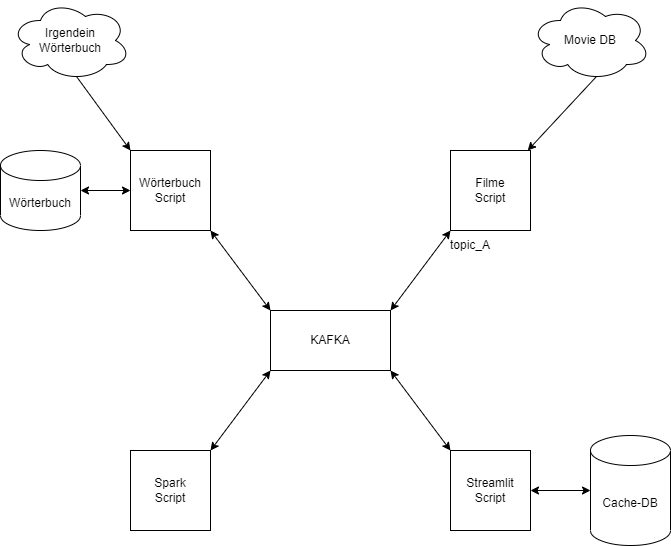

# TLDR; Filmrezensionen | 20-Wort-Konsensus

*Dokumentation zum Abschlussprojekt zur LV "Data Science Infrastructure"*

## Team

-   Yvonne Gisser
-   Dusan Resavac
-   Roland Bauer

## Ziel / Ergebnis

Das Ziel / Ergebnis dieses Projekts besteht darin, Filmrezensionen beliebiger Filme auf eine einfache sowie anschauliche Art zusammenzufassen, sodass der Konsens verschiedener Meinungen auf einem einzigen Blick ersichtbar ist. Dies wird anhand einer Webapplikation zum Anzeigen einer Schlagwortwolke (Word Cloud) realisiert, welche die, aus den Filmrezensionen am häufigst vorkommenden, Adjektive darstellt (wobei max. die 20 am häufigst vorkommenden Adjektive verwendet werden, um eine einfache Lesbarkeit der Word Cloud sicherzustellen). Die Größe des Wortes steht dabei proportional zu dessen Häufigkeit.

## Architektur

Die Architektur dieses Projekts ist folgendermaßen aufgebaut:

Dementsprechend gibt es **4 Microservices** mit **Kafka** als zentralen Message Broker. 

Um ein besseres Verständnis für diese Microservices zu schaffen, werden sie in den kommenden Absätzen genauer beschrieben (für mehr Informationen kann außerdem der Code der einzelnen Scripts betrachtet werden - dieser ist durchgehend kommentiert): 

### 1. Streamlit Script (siehe in der Architektur rechts unten)

Das Streamlit Script (in der Verzeichnisstruktur unter worldcloud_app zu finden) stellt das Frontend des Projekts dar. Dabei kann der/die Endbenutzer/in 3 verschiedene Aktionen ausführen:
   - Er/Sie kann einen beliebigen Filmtitel eingeben und sich somit die Word Cloud der dazugehörigen Filmrezensionen anzeigen lassen,  
   - sich die Word Cloud der Filmrezensionen des aktuell populärsten Films anzeigen lassen (dieser wird täglich aktualisiert) und
   - die Caching-Datenbank leeren.
       
### 2. Filme Script (siehe in der Architektur rechts oben)

Das Filme Script (in der Verzeichnisstruktur unter movie_script zu finden) empfängt die Anfragen für neue Filmrezensionen via Kafka vom Streamlit Script, holt sich die notwendigen Daten (= ID des Films, Titel des Films und Bewertungen des Films) aus der Movie DB und sendet diese zurück an Kafka.
   
### 3. Wörterbuch Script (siehe in der Architektur links oben)
Das Wörterbuch Script (in der Verzeichnisstruktur unter dictionary_script zu finden) lädt beim Starten des Containers, je nach übergebenem Argument (über docker-compose.yml konfigurierbar), die Adjektive aus der entsprechenden Quelle*, empfängt die Anfragen via Kafka vom Filme Script, filtert die Filmrezensionen nach deren Adjektiven und sendet schließlich die gefilterten Rezensionen gemeinsam mit der ID des Films und dem Titel des Films zurück an Kafka.

*Um eine Unterscheidung zwischen verschiedenen Wortarten zu ermöglichen, wurde die Key-Value-Datenbank Redis mit Adjektiven gefüllt. Die Daten können entweder über wordnet oder ein benutzerdefiniertes json, das von einem Stackoverflow-Benutzer mit dem NLTK (Natural Language Toolkit in Python) befüllt wurde, erworben werden. Beide Datensätze sind von hoher Qualität und können austauschbar oder je nach Vorliebe verwendet werden. Sie unterscheiden sich jedoch in der Dateistruktur, was durch Analyse der Funktionen read_nltk_extraction und read_word_net_dictionary oder durch direkte Betrachtung der Dateien im Verzeichnis Directory JSON oder adjectives_wordnet.adj ersichtlich wird.

### 4. Spark Script (siehe in der Architektur links unten)

Das Spark Script (in der Verzeichnisstruktur unter Spark_script zu finden) wird einerseits für Analysezwecke verwendet, dh. es
   - vereint die json-Dateien, die eine mögliche Quelle für Adjektive darstellen und transformiert den Inhalt in eine einzelne json-Datei, 
   - ermittelt die Anzahl aller adjektivischer Bedeutungen jedes Wortes und
   - gibt die Anzahl an Wörtern zurück, die zumindest eine adjektivische Bedeutung haben.

Andererseits empfängt es neue Anfragen (gefiltert) via Kafka vom Wörterbuch Script, macht ein Wordcount der Adjektive und sendet die empfangenen Daten und die Wordcounts wieder an Kafka. 

Um ebenfalls ein besseres Verständnis für Kafka als zentralen Message Broker zu schaffen, werden im kommen Absatz die einzelnen Kafka Topics erläutert: 

### 1. "new_movie_title"

Streamlit Script --> Filme Script

### 2. "movie_reviews"

Filme Script --> Wörterbuch Script 

### 3. "adjectives"

Wörterbuch Script --> Spark Script 

### 4. "adjectives_counted"

Spark Script --> Streamlit Script

## Metadatenmodell
Um einen genaueren Einblick in die verwendeten Daten dieses Projekts zu gewähren, folgt eine Zusammenfassung der Felder aus Dateien, Kafka-Nachrichten und API-Anworten: 

### 1. Filme Script
Um präzise Filmdaten abrufen zu können, wird die sogenannte "The Movie Database (TMDB)" (in der Achitektur unter Movie DB zu finden) verwendet (siehe: https://www.themoviedb.org/documentation/api). Wie bereits erwähnt, bietet die Webapplikation dieses Projekts den Nutzern u.a. die Möglichkeiten einen Filmtitel einzugeben und sich die Word Cloud aus dessen Filmrezensionen oder sich die Word Cloud des aktuell populärsten Films anzeigen zu lassen. 

In beiden Fällen sind die folgenden Informationen notwendig: 

- **original_title** - ``String``: Der Originaltitel des Films, der sich vom *title* Feld unterscheiden kann. Wenn z.B. nach "Puss in boots" gesucht und der Sprachparameter auf "de-DE" gesetzt wird, lautet der "original_title" "Puss in boots" und der "title" "Der gestiefelte Kater".

- **id** - ``Integer``: Eindeutiger Bezeichner für Filme. 

- **content** - ``String``: Der Text einer Rezension. 

Die Kernfunktion wird beim Empfang ausgeführt: 

- entweder **get_most_pop** - ``String``: Einfache Zeichenkette, die nach Bewertungen für einen der derzeit beliebtesten Filme fragt. In diesem Fall werden keine weiteren Informationan angegeben. 

- oder **movie-title** - ``String``: Gibt an, dass Bewertungen für eine gegebene Zeichenkette, die teilweise oder vollständig mit einem Filmtitel übereinstimmt, angefordert werden. Nach dieser Zeichenfolge folgt die Benutzereingabe. 

Das Filme Script extrahiert alle Wörter aus jeder Rezension und behält dabei im Auge, welche Wortliste zu welcher Rezension gehört --> Liste von Listen für Analysezwecke oder zukünftige Funktionen. Anschließend sendet es 3 wichtige Variablen an Kafka:

- **movie_id** - ``Integer``: Eindeutiger Bezeichner für Filme.
- **title** - ``String``: Der Originaltitel des Films.
- **reviews** - ``[[String String, ...], [...], ...]``: Die Liste der Listen mit allen Wörtern pro Rezension.

### 2. Wörterbuch Script
Für das Wörterbuch, welches zwischen zwei Worarten unterscheidet, hat der/die End-Benutzer/in die Möglichkeit, zwischen 2 zuverlässigen Quellen zu unterscheiden:

#### NLTK
Ein Datensatz, der in mehrere json-Dateien aufgeteilt ist und aus einer Stackoverflow-Antwort stammt (siehe: https://stackoverflow.com/questions/41768215/english-json-dictionary-with-word-word-type-and-definition/54982015#54982015). Die Daten wurden angeblich mit dem Python Natural Language Toolkit generiert, was nach unseren Untersuchungen im Vergleich zu den WORD-Daten zuzutreffen scheint. Dies deutet darauf hin, dass die Daten zuverlässig und vergleichbar mit den WORD-Daten sind (deren Reinheit und Zuverlässigkeit nahezu unbestritten ist).

Die zu verwendenden Daten liegen in einem Dictionary-Format vor, bei dem die Wörter die Schlüssel und die entsprechenden Daten die Werte sind:

- **Dictionary key** - ``String``: Der Schlüssel des Dictionaries enthält das Wort.
- **MEANINGS** - ``{key: [String, String, [String, ...]]}``: Ein Dictionary, dessen Werte die verschiedenen Bedeutungen darstellen, die ein Wort je nach Kontext haben kann. Der erste Eintrag eines jeden Wertes ist der Part-Of-Speech, der für die Erstellung unseres Wörterbuchs relevant ist. 

#### Wordnet
Wordnet ist eine große lexikalische Datenbank der englischen Sprache. Die Daten sind in einem proprietären Dateiformat enthalten. Ein kleines Beispiel für eine einzelne Zeile: 00005107 00 s 02 full-length 0 uncut 0 001 & 00004980 a 0000 | complete; "the full-length play". Der Buchstabe am Anfang (in diesem Fall s) kennzeichnet das Wort entweder als "satellite adjective" (Satellitenadjektiv) s oder als "adjective" (Adjektiv) a. Es gibt eine eigene Unterscheidung, die nur von wordnet verwendet wird, um zwischen zwei verschiedenen Arten von Adjektiven zu unterscheiden (siehe: https://stackoverflow.com/questions/18817396/what-part-of-speech-does-s-stand-for-in-wordnet-synsets).

##### Kafka Daten empfangen und senden
Wenn der Consumer eine neue Nachricht erhält, wird erwartet, dass die Nachricht zu den genannten Daten vom Filme Script gesendet weird. 

Die Bewertungen der Daten werden dann so gefiltert, dass nur Adjektive übrig bleiben. Die an Kafka gesendeten Daten sind dann:

Die Bewertungen der Daten werden dann so gefiltert, dass nur Adjektive übrig bleiben. Die Daten werden dann an Kafka gesendet: 

- **movie_id** - ``Integer``: Der eindeutige Bezeichner des Films.
- **title** - ``String``: Der Originaltitel des Films.
- **reviews** - ``[[String String, ...], [...], ...]``: Eine Liste von Listen mit einzelnen Adjektiven. 

### 3. Spark Script
Die Daten der Map-Reduce-Funktion sind die vom Wörterbuch Script gesendeten Daten. 

Nach dem Zählen der Vorkommen jedes Adjektivs werden die vom Wörterbuch Scrit empfangenen Daten und die folgenden Daten an Kafka gesendet: 

- **counted_words** - ``[[String, Integer], [String, Integer], ...]``: Eine Liste von Listen. Jeder Eintrag in der äußersten Liste ist eine Liste mit dem Wort an der ersten Position und seiner Menge an der zweiten Position, z.B. ``[["impressive", 1], ["different", 3], ...]``

## Setup
Um das Projekt einwandfrei zum Laufen zu bringen sind folgende Schritt durchzuführen: 

1. `docker-compose up -d` ausführen  
**INFORMATION:** Vor dem Start des Containers kann die Quelle, aus der das Wörterbuch erstellt wird, ausgewählt werden. Dazu muss die Zeichenfolge nach dem Befehl -d unter "dictionary" in der Datei ``docker-compose.yml`` entweder in "wordnet", "wordnet_all" oder in "nltk" geändert werden. Dies kann jedes Mal geändert werden, bevor der Container gestartet wird (er muss nicht neu erstellt werden).
2. Jupyter öffnen und `!pip install kafka-python` ausführen
3. Code chunk **wordcount** in JupyterLab innerhalb des Jupyter/Spark-Containers starten
4. <a href="http://localhost:8501/" target="_blank">Wordcloud App</a> öffnen

## Features
Hier nochmal die Zusammenfassung der Features dieses Projekts:
1. Film über Titel abfragen (Freitextfeld)
2. Most popular Film abfragen
3. Cache-Tabelle löschen

## Mögliche Suchphrasen
Um die Applikation zu testen, empfehlen wir folgende Eingaben: 
### Kurze Suchphrasen mit Bewertungen

-   Matrix
-   Captain
-   matrix
-   matrix revolutions
-   captain
-   unforgiven

### Kurze Suchphrasen ohne Bewertungen

-   green
-   forest

### Vollständige Filmtitel

-   The Matrix
-   Captain Marvel
-   The Matrix Revolutions
-   Unforgiven
